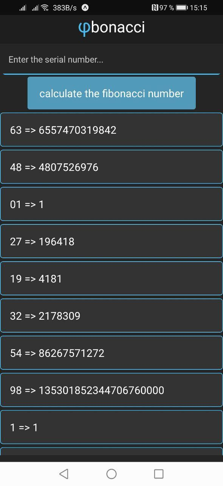

<h1>Fibonacci</h1>

  Fibonacci is an application for determining the 
  <a href="https://simple.wikipedia.org/wiki/Fibonacci_number">number of Fibonacci</a>
   by its serial number.

<h1>Demo</h1>

  
  

<h1>Screenshots</h1>

  
  
  

<h1>Tools</h1>

Key tools used in this React native project are:

<table>
  <thead>
    <tr>
      <th align="center">Tool</th>
      <th>Description</th>
    </tr>
  </thead>
  <tbody>
    <tr>
      <td align="center">
        <a href="https://reactnative.dev/" rel="nofollow">React native</a>
      </td>
      <td>
        Is an open-source mobile application framework created by Facebook. 
        It is used to develop applications for Android, iOS, 
        Web and UWP by enabling developers to use <a href="https://ru.reactjs.org/" rel="nofollow">React</a>  
        along with native platform capabilities.
      </td>
    </tr>
    <tr>
      <td align="center">
        <a href="https://expo.io/" rel="nofollow">Expo</a>
      </td>
      <td>
        With Expo tools, services, and <a href="https://ru.reactjs.org/" rel="nofollow">React</a>, you can build, deploy, 
        and quickly iterate on native Android, iOS, and web apps from 
        the same JavaScript codebase.
      </td>
    </tr>
    <tr>
      <td align="center">
        <a href="https://www.typescriptlang.org/index.html" rel="nofollow">TypeScript</a>
      </td>
      <td>
        It is a strict syntactical superset of JavaScript and adds optional 
        static typing to the language.
      </td>
    </tr>
    <tr>
      <td align="center">
        <a href="https://mobx.js.org/README.html" rel="nofollow">MobX</a>
      </td>
      <td>
        Is a simple, scalable and battle tested state management solution.
      </td>
    </tr>
  </tbody>
</table>
<h1>Author</h1>
<a href="https://github.com/faserman" rel="nofollow">faserman</a>
